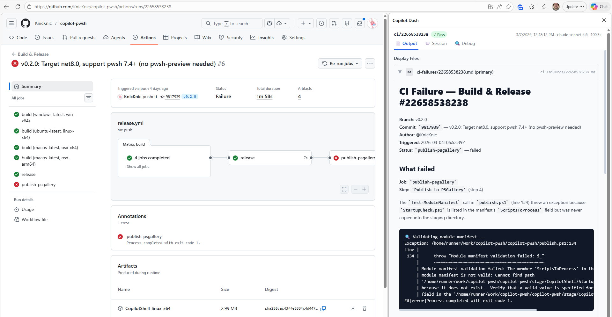

# 🚀 Copilot Dash

A dashboard for viewing Copilot CLI run results, resuming sessions, and integrating with your browser via an Edge extension.

## Architecture

```
copilot-dash/
├── server/          # Express + Socket.IO backend (TypeScript)
├── web/             # React + Vite frontend (TypeScript + Tailwind)
├── extension/       # Edge browser extension (Manifest V3)
├── scripts/         # PowerShell install/setup scripts
└── docs/            # Documentation & example scripts
    ├── run-files.md           # Run file format spec & use cases
    └── examples/
        ├── Invoke-CopilotTask.ps1       # Wrapper that produces run_details.json
        ├── ci-failure.prompt.md         # Example: diagnose a failed CI run
        ├── get-failed-runs.ps1          # List failed Actions runs via gh CLI
        └── triage-ci-failures.ps1       # Batch: pipe runs → Invoke-CopilotTask
```

## Quick Start

### One-command setup

```powershell
# Clone, install everything, and build
.\scripts\install.ps1
```

Or manually:

```powershell
npm run setup    # equivalent: install all deps + build web UI
```

### Start the server

```powershell
npm start        # production (serves built frontend)
```

### Development mode

```powershell
npm run dev      # runs server + vite dev server with hot reload
```

Server: http://localhost:3456 | Vite Dev: http://localhost:5173

---

## Components

### 1. Backend Server (`server/`)

Node.js/TypeScript server that:
- **Scans** configured directories for `.copilot_runs/**/run_details.json` files
- **Watches** for new/modified/deleted run files in real time (via chokidar)
- **Serves** the built web UI as static files
- **Provides** REST API + WebSocket for real-time updates
- **Manages** Copilot SDK sessions for chat resumption

**Configuration** is stored at `~/.copilot-dash/config.json`:
```json
{
  "scanDirectories": ["C:\\code\\my-project", "C:\\code\\another-project"],
  "port": 3456
}
```

**Setting up runs:** The server scans each directory in `scanDirectories` for `.copilot_runs/**/run_details.json` files. To produce these files, use the [`Invoke-CopilotTask.ps1`](docs/examples/Invoke-CopilotTask.ps1) wrapper script, which manages the full lifecycle — MCP config generation, prompt parsing, Copilot SDK session creation, and saving run metadata. The script depends on the [CopilotShell](https://github.com/KnicKnic/copilot-pwsh) PowerShell module (PowerShell 7 required).

```powershell
# Single run with a prompt
.\Invoke-CopilotTask.ps1 "Explain the auth flow" -Name "docs/auth"

# With a prompt file
.\Invoke-CopilotTask.ps1 -PromptFile .github/prompts/review.prompt.md `
    -Name "review/pr-1042"

# Triage a GitHub issue — URL matching opens it in the Edge extension side panel
$issue = 4521
.\Invoke-CopilotTask.ps1 "Triage issue $issue" `
    -PromptFile .github/prompts/triage.prompt.md `
    -Name "issues/$issue" `
    -UrlRegexp "https://github\.com/owner/repo/issues/$issue" `
    -DisplayFiles "output/issues/$issue.md"

# Diagnose a failed CI run — browse to the Actions run and see the report in the side panel
$run = 14928374651
.\Invoke-CopilotTask.ps1 "Diagnose failed CI run $run in owner/repo" `
    -PromptFile .github/prompts/ci-failure.prompt.md `
    -Name "ci/$run" -RunOnce `
    -UrlRegexp "https://github\.com/owner/repo/actions/runs/$run" `
    -DisplayFiles "ci-failures/$run.md"

# Date-stamped daily report (idempotent — skips if already run today)
$date = Get-Date -Format "yyyy-MM-dd"
.\Invoke-CopilotTask.ps1 "Generate daily summary for $date" `
    -PromptFile .github/prompts/daily-report.prompt.md `
    -Name "reports/$date" -RunOnce `
    -DisplayFiles "reports/$date.md"
```

See [docs/run-files.md](docs/run-files.md) for the complete field reference, all parameters, and more examples.

#### API Endpoints

| Method | Path | Description |
|--------|------|-------------|
| GET | `/api/runs` | List all runs (sorted by timestamp) |
| GET | `/api/runs/tree` | Get runs as a tree by name |
| GET | `/api/runs/match?url=<url>` | Find runs matching a URL |
| GET | `/api/runs/:id` | Get a specific run |
| GET | `/api/runs/:id/file?path=<path>` | Read a file from run's working dir |
| GET | `/api/runs/:id/history` | Get all versions of a run by name |
| GET | `/api/config` | Get current config |
| PUT | `/api/config` | Update config |
| POST | `/api/config/scan` | Force re-scan |
| GET | `/api/config/watch-status` | Watcher debug status |
| POST | `/api/config/directories` | Add a scan directory |
| DELETE | `/api/config/directories` | Remove a scan directory |
| GET | `/api/sessions/status` | Check SDK availability |
| POST | `/api/sessions/:id/resume` | Resume a Copilot session |
| GET | `/api/sessions/:id/messages` | Get session messages |
| POST | `/api/sessions/:id/send` | Send a message |
| DELETE | `/api/sessions/:id` | Close a session |

### 2. Web UI (`web/`)

React application with two modes:

#### Admin Dashboard (`/admin/*`)
Full dashboard with left navigation sidebar:
- **Recent Runs** (`/admin/recent`) — Live-updating chronological list
- **Tree View** (`/admin/tree`) — Hierarchical view by run name
- **Configuration** (`/admin/config`) — Manage scan directories, view watcher status

#### Run Viewer (`/view/:id`)
Standalone viewer (no sidebar) designed for embedding in the Edge extension:
- **Output tab** — View prompt file, agent info, display files (with rich Markdown rendering)
- **Session tab** — Resume and interact with the Copilot SDK session
- **Debug tab** — Raw JSON data, file paths, force-refresh

### 3. Edge Extension (`extension/`)

Manifest V3 browser extension for Microsoft Edge:
- Monitors tab URLs against run `urlRegexp` patterns
- Changes icon when a matching run is found (blue = active, gray = inactive)
- Opens a side panel with the run viewer for matching tabs
- Side panel loads per-tab, not per-window

#### Installing the Extension

1. Generate icons (if not already done):
   ```powershell
   cd extension && node generate-icons.js
   ```
2. Open Edge → `edge://extensions/`
3. Enable **Developer mode**
4. Click **Load unpacked** → select the `extension/` folder
5. The extension icon appears in the toolbar

---

## Run File Format

See [docs/run-files.md](docs/run-files.md) for the complete run file specification, the producer script (`Invoke-CopilotTask.ps1`), and more examples.

Place files at `<scan_dir>/.copilot_runs/<any_path>/run_details.json`:

```json
{
  "version": "0",
  "exitCode": 0,
  "success": true,
  "sessionId": "83af2a4d-b826-4eed-8023-0f4feaadc619",
  "workingDirectory": "C:\\code\\my-project",
  "name": "issues/4521",
  "agent": null,
  "promptName": "triage",
  "displayFiles": ["output/issues/4521.md"],
  "urlRegexp": "https://github\\.com/owner/repo/issues/4521",
  "timestamp": "2026-02-06T18:10:05.977-08:00",
  "gitCommit": "abc123",
  "promptFile": ".github/prompts/triage.prompt.md",
  "model": "gpt-5.2-codex",
  "duration": 36.87,
  "gitBranch": "main"
}
```

---

## Auto-Start & System Tray

### System Tray Icon

```powershell
npm run start:tray    # starts server with system tray icon
```

The tray icon provides:
- **Open Dashboard** — opens browser to http://localhost:3456
- **Restart Server** — restarts the backend
- **Exit** — stops everything

### Auto-Start on Login

```powershell
# Set up auto-start (creates a Windows scheduled task)
.\scripts\setup-autostart.ps1

# Remove auto-start
.\scripts\setup-autostart.ps1 -Remove
```

This creates a scheduled task that runs the server in the background whenever you log in. Logs go to `~/.copilot-dash/server.log`.

---

## Copilot SDK Sessions

To use the Session tab (resume and chat with Copilot sessions):

1. Set the `GITHUB_TOKEN` environment variable:
   ```powershell
   $env:GITHUB_TOKEN = "ghp_your_token_here"
   ```
2. Install the SDK (included in dependencies):
   ```powershell
   cd server && npm install @github/copilot-sdk
   ```

Sessions are cached for **3 minutes** of inactivity. Navigating between tabs or pages keeps the session alive.

### MCP Environment Variable Workaround

The Copilot SDK/CLI has a [known bug](https://github.com/github/copilot-sdk/issues/163) where environment variables defined in MCP server configurations are **not propagated** to the spawned server processes. This breaks any MCP server that relies on `env` (e.g., API keys, tokens) or `cwd`.

As a workaround, this project uses [`mcp-wrapper`](https://github.com/github/copilot-sdk/issues/163) — a transparent stdin/stdout proxy that properly sets environment variables before launching the MCP server process. When resuming a session, any local MCP server with `env` or `cwd` defined is automatically rewired to launch through `mcp-wrapper`:

```
# What the SDK sees:
command: mcp-wrapper.exe
args: [--env, API_KEY=secret, --env, TOKEN=xyz, --cwd, C:\project, --, npx, my-mcp-server]

# What actually happens:
mcp-wrapper sets the env vars → launches npx my-mcp-server → proxies stdin/stdout/stderr
```

Servers without `env`/`cwd` are passed through unchanged.

**Resolution order for `mcp-wrapper`:**
1. Check `PATH` (via `where` / `which`)
2. Fall back to `~/Documents/PowerShell/Modules/CopilotShell/mcp-wrapper.exe` (current-user install)
3. Fall back to `C:\Program Files\PowerShell\7\Modules\CopilotShell\mcp-wrapper.exe` (system-wide install)

If `mcp-wrapper` is not found, the server logs a warning and MCP servers with env vars may fail silently.

---

## Development

### Prerequisites

- Node.js 20+
- npm 10+
- Microsoft Edge (for the extension)

### Project Structure

```
server/src/
  ├── index.ts          # Express server entry point
  ├── config.ts         # Config file management (~/.copilot-dash/)
  ├── scanner.ts        # Directory scanning & file parsing
  ├── watcher.ts        # Real-time file watching (chokidar)
  ├── sessionManager.ts # Copilot SDK session lifecycle
  ├── tray.ts           # System tray icon (systray2)
  ├── types.ts          # TypeScript interfaces
  └── routes/
      ├── runs.ts       # Run CRUD & matching API
      ├── config.ts     # Configuration API
      └── sessions.ts   # Session management API

web/src/
  ├── main.tsx          # React entry point
  ├── App.tsx           # Router setup
  ├── api.ts            # Backend API client
  ├── useSocket.ts      # Socket.IO hook for real-time updates
  ├── types.ts          # TypeScript interfaces
  ├── components/       # Reusable UI components
  └── pages/            # Route page components
```

### Building

```powershell
npm run build:web      # Build frontend → server/public/
npm run build:server   # Compile TypeScript → server/dist/
npm run build          # Both
```

---

## Troubleshooting

| Issue | Solution |
|-------|----------|
| "Frontend not built" error | Run `npm run build:web` |
| SDK not available | Set `GITHUB_TOKEN` env var and restart server |
| Extension not matching URLs | Check the `urlRegexp` field in your run files |
| File watcher not detecting changes | Check `/admin/config` watch status |
| Port already in use | Change port in `~/.copilot-dash/config.json` |
